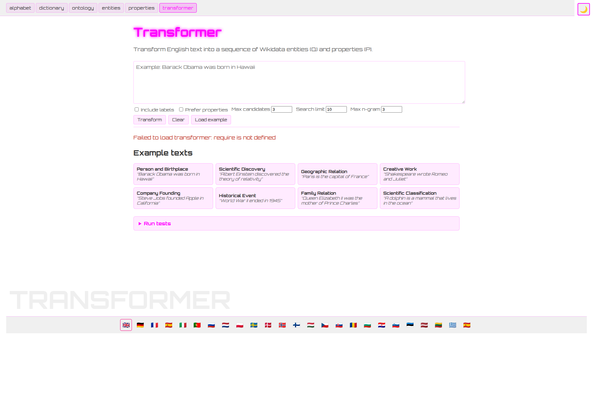
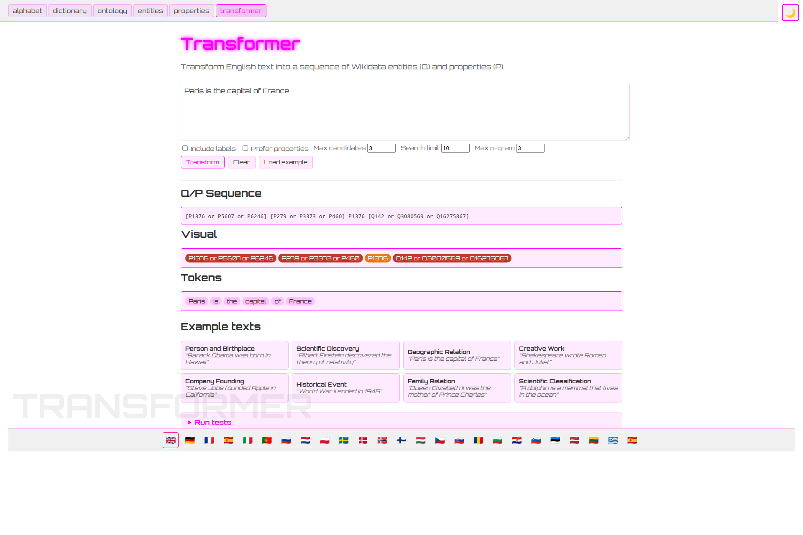

# Case Study — Issue #35

> **Issue:** [link-assistant/human-language#35](https://github.com/link-assistant/human-language/issues/35)
> "Transformer does not work, that needs to be fixed, and e2e tests for all other sections"
> **Pull request:** [#36](https://github.com/link-assistant/human-language/pull/36)
> **Branch:** `issue-35-0373f2491b21`

## Summary

The unified SPA at `app.html` shipped with the Transformer mode broken on
GitHub Pages: opening `#mode=transformer` immediately rendered the banner
**"Failed to load transformer: Can't find variable: require"** (Safari) /
**"require is not defined"** (Chromium). The button to run a
transformation stayed disabled forever because the React effect that
constructs the transformer crashed on the first line.

In parallel the repo was missing the test coverage to catch this kind of
regression: there were no e2e tests for any of the six modes (alphabet,
dictionary, ontology, entities, properties, transformer) and only one of
the JavaScript modules (`app/routing.js`, now `js/src/app/routing.js`)
had any structural test coverage. CI was split across three workflow
files (`test.yml`, `pages.yml`, `links.yml`) and didn't gate the Pages
deploy on tests. JavaScript files were also scattered across the repo
root rather than living under a single `./js/` tree.

## Documents in this case study

| File | Purpose |
| --- | --- |
| [`requirements.md`](./requirements.md) | Verbatim list of every requirement extracted from the issue body, with the status of each in PR #36. |
| [`timeline.md`](./timeline.md) | Chronological reconstruction of what was committed, in what order, and why. |
| [`root-cause.md`](./root-cause.md) | Deep dive into _why_ the transformer broke under babel-standalone — the specific Babel transform, the call chain, and the proof. |
| [`solution-plans.md`](./solution-plans.md) | The fix that shipped, plus the alternatives we considered and the reasons they were rejected. |
| [`ci-template-comparison.md`](./ci-template-comparison.md) | Side-by-side comparison of the new `js.yml` workflow against the patterns from `link-foundation/js-ai-driven-development-pipeline-template` and `…rust-…-template`. |
| [`external-research.md`](./external-research.md) | Upstream / related issues found in `@babel/standalone`, browsers, and other tools that informed the fix. |
| [`issue-screenshot.png`](./issue-screenshot.png) | The screenshot attached to the original issue showing the broken transformer banner. |

## The fix in one sentence

`app.html` now `import`s `js/src/transformation/text-to-qp-transformer.js`,
`js/src/transformation/text-transformer-test.js`, and the demo helper
directly in a real ES Modules `<script type="module">` and exposes them
on `window.HumanLanguageApp`; `js/src/app/modes/transformer.jsx` reads
them off `window` instead of using the dynamic `import()` that
babel-standalone silently rewrote to `require(...)`. See
[`root-cause.md`](./root-cause.md) for the proof.

## Headline before / after

| Before | After |
| --- | --- |
|  |  |

The regression is now permanently guarded by a Playwright test
(`js/tests/e2e/app.spec.mjs`) that asserts:
* the `Transformer` heading is visible at `#mode=transformer`,
* the body contains neither `Failed to load transformer` nor `require is not defined`,
* the `Transform` button becomes enabled within 5s of page load,
* clicking it produces a `Q/P Sequence` panel containing at least one `Q…` or `P…` id.
